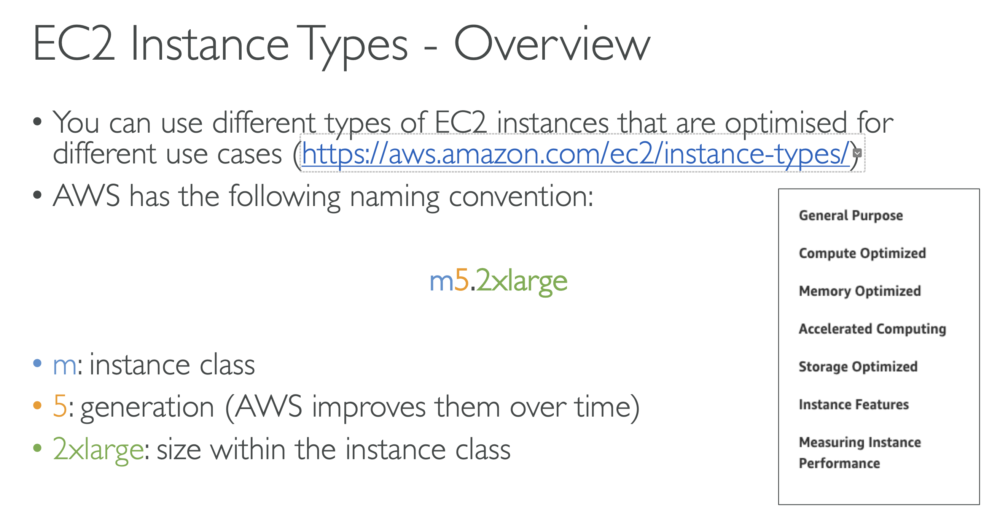

# EC2 Fundamentals

### Amazon EC2

* EC2 là một trong những dịch vụ AWS phổ biến nhất
* EC2 = Elastic Compute Cloud = Infrastructure as a Service
* Các chứng năng chính của EC2:
  * Cho thuê máy ảo (EC2)
  * Lưu trữ dữ liệu trên đĩa ảo (EBS)
  * Phân phối tải trên các máy (ELB)
  * Mở rộng dịch vụ bằng cách sử dụng `auto-scaling` group (ASG)
* Hiểu biết về EC2 là bước cơ bản để có sự hiểu biết về cách làm việc của `cloud`

### EC2 sizing & configuration options

* Hệ điều hành: Linux, Windows or Mac OS
* CPU (Compute power & cores)
* RAM
* Storage spage:
  * Network-attached (EBS & EFS)
  * Hardware (EC2 Instance Store)
* Network card: tốc độ mạng, Public ID
* Firewall rules: security group
* Bootstrap script (configure at first launch): EC2 User Data

### EC2 User Data

* Có thể chạy 1 tập lệnh (EC2 User Data script) khi khởi động EC2. Tập lệnh này chỉ chạy trong lần đầu khởi động EC2.
* EC2 user data sử dụng để tự động chạy các task như:
  * Installing updates
  * Installing software
  * Download common files from the internet
  * Anything you can think of
* EC2 User Data Script chạy với root user

### EC2 Instance Types - Overview

* Có thể chọn các kiểu EC2 instances khác nhau tối ưu cho các từng use cases.

#### EC2 Instance Types – General Purpose

* Sử dụng tốt cho Web servers, hoặc code repositories
* Cân bằng giữa:
  * Tính toán
  * Bộ nhớ
  * Mạng

#### EC2 Instance Types – Compute Optimized

* Sử dụng trong các nhiệm vụ tính toán yêu cầu hiệu suất cao như:
  * Batch processing workloads
  * Media transcoding
  * High performance web servers
  * High performance computing (HPC)
  * Scientific modeling & machine learning
  * Dedicated gaming servers

#### EC2 InstanceTypes – Memory Optimized

* Hiệu suất tốt cho các công việc xử lý dữ liệu lớn trên bộ nhớ:
  * High performance, relational/non-relational databases
  * Distributed web scale cache stores
  * In-memory databases optimized for BI (business intelligence)
  * Applications performing real-time processing of big unstructured data

### EC2 InstanceTypes – Storage Optimized

* Sử dụng tốt cho các tác vụ yêu cầu cao về bộ nhớ (Great for storage-intensive tasks that require high, sequential read and write access to large data sets on local storage):
  * High frequency online transaction processing (OLTP) systems
  * Relational & NoSQL databases
  * Cache for in-memory databases (for example, Redis)
  * Data warehousing applications
  * Distributed file systems

  ### EC2 Instances Purchasing Options

  