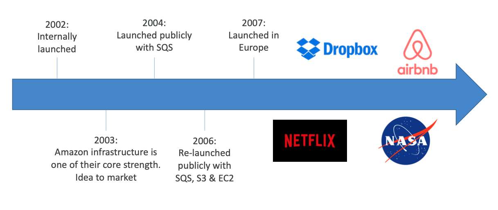
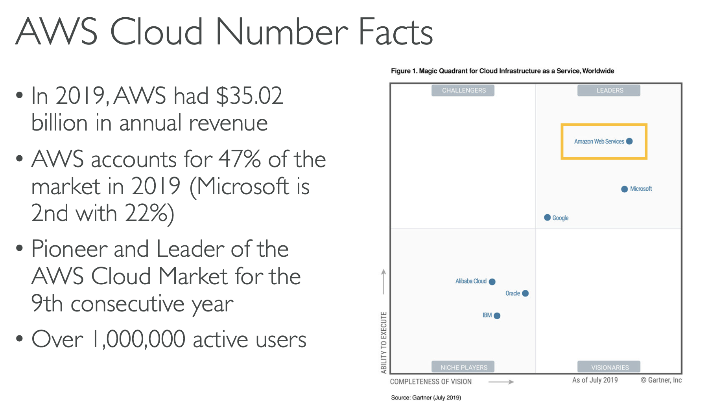
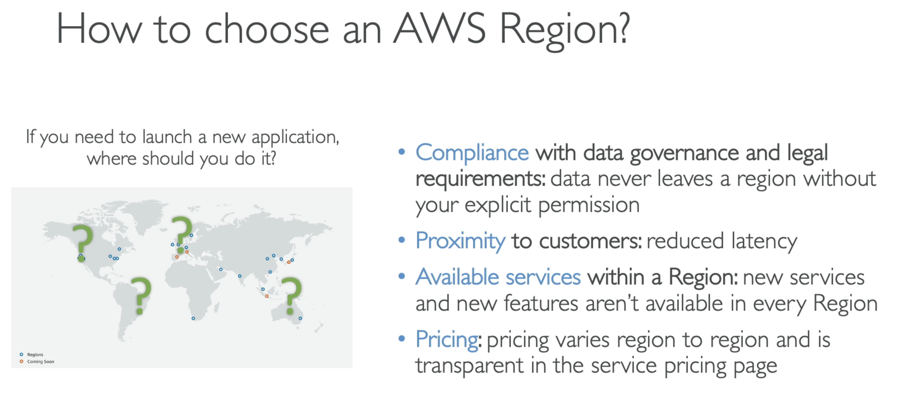
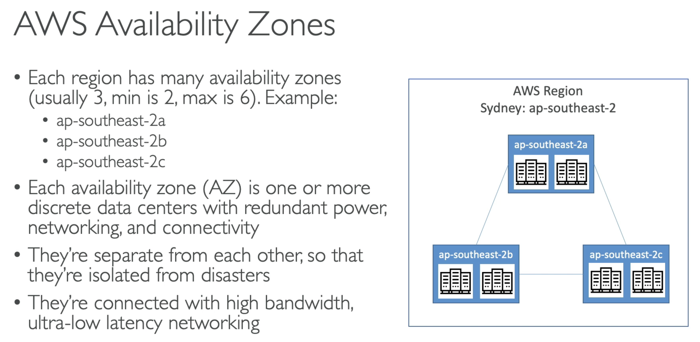
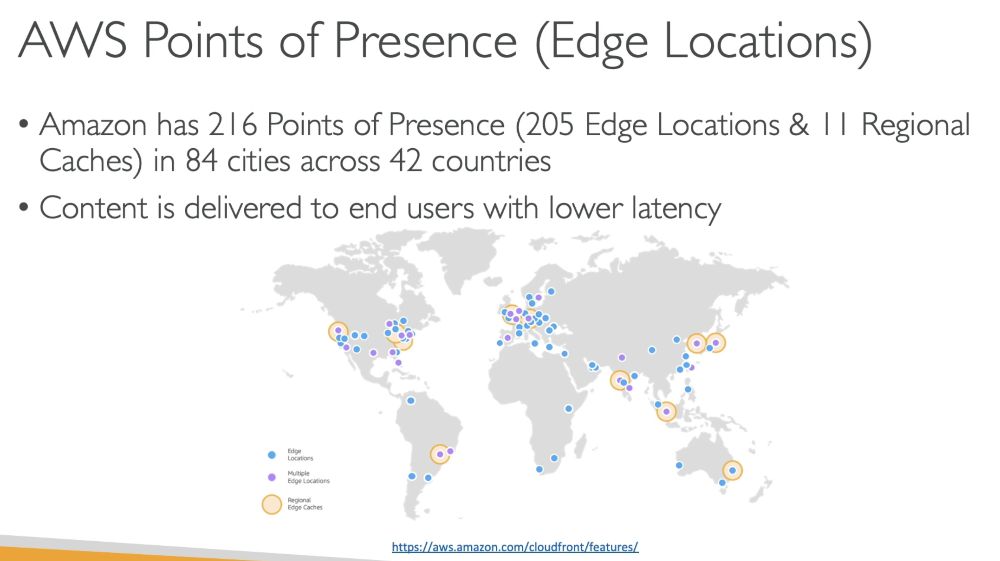

# Getting started with AWS

* [Getting Started](#getting-started)
* [AWS Cloud Use Cases](#aws-cloud-use-cases)
* [AWS Global Infrastructure](#aws-global-infrastructure)

---

### Getting Started

#### Lịch sử AWS

* 2002: bắt đầu bằng một dự án nội bộ
* 2003: cơ sở hạ tầng Amazon là một trong những thế mạnh chính của họ.
* 2004: cung cấp dịch vụ ra bên ngoài với dịch vụ SQS (Amazon Simple Queue Service)
* 2006: mở rộng thêm các dịch vụ: SQS, S3 & EC2
* 2007: bắt đầu cung cấp dịch vụ ở châu Âu
* Và ngày nay, có rất nhiều ứng dụng chạy trên AWS Cloud như: Dropbox, Netflix, Airbnb, Nasa

#### Các con số thực tế về AWS Cloud

* Trong năm 2019, doanh thu hàng năm của AWS đạt 35.02 tỉ đô
* Số lượng tài khoản AWS chiếm 47% thị trường năm 2019 (Microsoft đứng thứ 2 với 22%)
* Năm thứ 9 liên tiếp tiên phong và dẫn đầu thị trường điện toán đám mây
* Có trên 1000000 người dùng (active users)

### AWS Cloud Use Cases

* AWS cho phép bạn xây dựng các ứng dụng phức tạp, và có khả năng mở rộng
* Có thể áp dụng cho nhiều ngành công nghiệp khác nhau
* Ứng dụng có thể sử dụng AWS bao gồm:
  * Enterprise IT, Backup & Storage, Big Data analytics
  * Web hosting, Mobile & Social Apps
  * Gaming

### AWS Global Infrastructure

#### AWS Regions

* AWS có các khu vực (Regions) trên toàn thế giới
* Tên các khu vực có thể là: `us-east`, `eu-west-3`...
* Một khu vực bao gồm một cụm các trung tâm dữ liệu
* Hầu hết các dịch vụ của AWS đều có phạm vi khu vực

Khi chọn vùng để bắt đầu một ứng dụng của bạn, cần quan tâm đến các yếu tố sau:

* Tuân thủ các yêu cầu pháp lý và quản lý dữ liệu
* Phải gần với khách hàng (để giảm độ trễ)
* Vùng đó có dịch vụ mà bạn cần hay không (các dịch vụ/tính năng mới thường chỉ có trên một số vùng nhất định)
* Giá của các dịch vụ sẽ khác nhau cho mỗi vùng

#### AWS Availability Zones

* Mỗi region sẽ có nhiều Availability Zones (AZ). Thường là 3, ít nhất là 2, và nhiều nhất là 6
* Mỗi một AZ là một hoặc nhiều Data Centers rời rạc với nguồn dự phòng, mạng, và sự kết nối
* Các AZ này tách biệt với nhau, đề phòng thiên tai, thảm hoạ
* Chúng (AZ) kết nối với nhau với băng thông cao (độ trễ cực thấp)

#### AWS Points of Presence (Edge Locations)

* AWS có 216 Point of Presence trong 84 thành phố trên 42 quốc gia
* Nội dung được phát hành đến người dùng với độ trễ thấp

Chi tiết trong `Global` section.